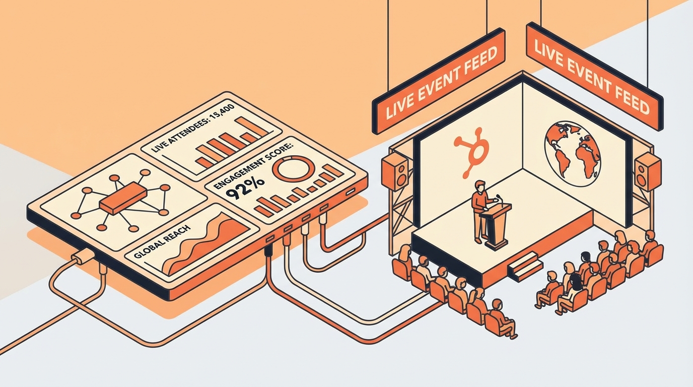

# The Ultimate Guide to Event Intelligence: What It Is & Why It Matters

**Slug**: /blog/marketing/event-intelligence-guide
**Meta Description**: Discover why event intelligence is the key to unlocking B2B ROI. Learn how to transform raw event data into actionable GTM signals and sales leads.
**Cover Image**: 

---

It’s the final day of your biggest industry conference. Your team has scanned thousands of badges. The booth was packed. But as you pack up, a nagging question remains: **Did we actually make any money here?**

For most B2B marketers, events are a black box. You pour budget in, hoping revenue comes out. But without a way to track what happens *captured* continuously, you're flying blind.

In this guide, we’ll explore **Event Intelligence**—the missing link between event chaos and predictable revenue.

## What is Event Intelligence?

**Event Intelligence** is the process of capturing, analyzing, and acting on data signals from events (trade shows, conferences, webinars) in real-time. Unlike simple lead retrieval (scanning a badge), event intelligence combines behavioral data, competitive insights, and market trends to give you a complete picture of your event ROI.

## Why Event Intelligence Matters

You might think "we have a CRM, we're fine." But standard CRMs miss the nuances of in-person interactions. Here is why you need specialized intelligence:

*   **Real-Time Decision Making**: Don't wait until next week to follow up. Know *who* to talk to while they are still in the hall.
*   **Competitive Advantage**: Events are where your competitors launch new products. Intelligence tools help you track their moves.
*   **ROI Transparency**: Move beyond "brand awareness" to hard attribution numbers.

**Pro Tip**: Use Event Intelligence to prioritize your post-event follow-up sequence based on engagement level, not just job title.

## How to Build an Event Intelligence Strategy

### 1. Capture Data Beyond the Badge

A name and email isn't enough. You need context.
*   **Dwell time**: How long did they stay at your booth?
*   **Content interaction**: Which demos did they watch?
*   **Session attendance**: What topics are they interested in?

### 2. Analyze in Real-Time

Data without analysis is noise. Use AI-driven tools to process the signals.

**Pro Tip**: Look for "Intent Signals"—actions that indicate a readiness to buy, such as asking about pricing or integration capabilities, rather than just "swag grabbers".

### 3. Act on Signals Immediately

The "half-life" of an event lead is short.
*   **Trigger workflows**: Automatically push high-intent leads to your sales team's Slack/Teams.
*   **Personalize content**: Send follow-up emails that reference the specific product they demoed.

**Pro Tip**: Enable sales reps to view the prospect's entire "Event Journey" before they make the first call.

## Conclusion

Event Intelligence turns the "chaos" of trade shows into a predictable revenue engine. By capturing the right data and acting on it instantly, you transform your event strategy from a cost center to a growth driver.

Stop guessing. Start knowing.

**Ready to upgrade your event strategy? [Check out our Event Intelligence Template](https://example.com) to get started.**
