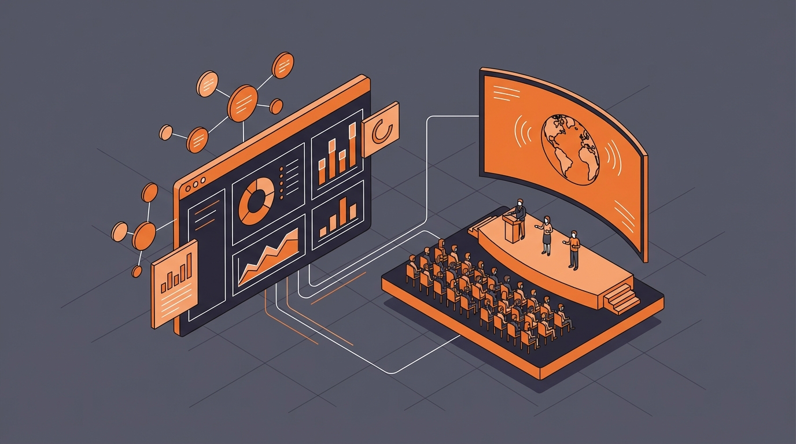
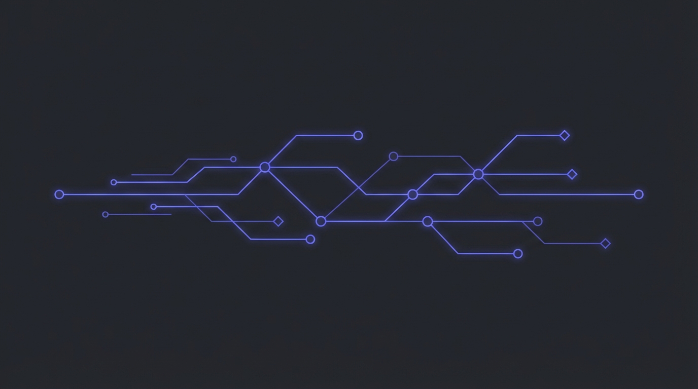
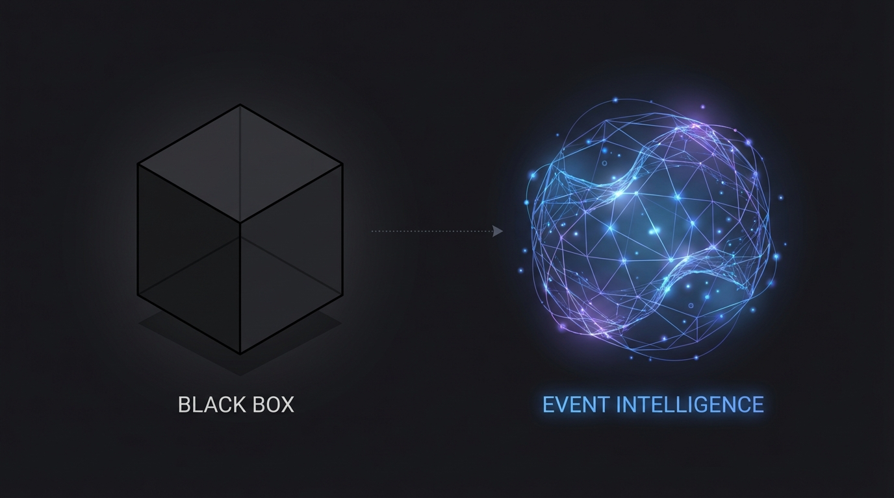
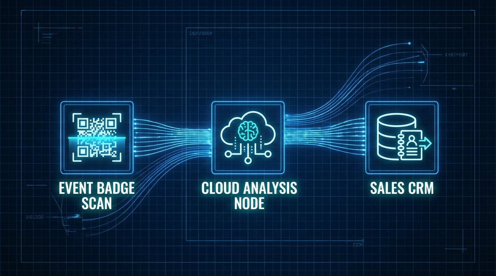

# The Future of B2B Marketing: Why Event Intelligence is Your Secret Weapon

**Slug**: /blog/marketing/event-intelligence-secret-weapon
**Meta Description**: Event Intelligence is transforming how B2B marketers calculate ROI. Learn how to turn trade show data into a predictable revenue engine in 2026.
**Cover Image**: 

---

It’s the final hour of CES. Your team is exhausted. You’ve scanned 5,000 badges. But as the booth lights dim, your VP of Sales asks the dreaded question: **"So, who are we closing next week?"**

If your answer is "I'll send you the spreadsheet on Monday," you've already lost.

In a world of instant data, trade shows are the last bastion of the "Wait and See" approach. But the top 1% of B2B marketers have stopped waiting. They are using **Event Intelligence**.

## What is Event Intelligence?

Event Intelligence is not just "lead retrieval." It is the real-time synthesis of behavioral data, attendee intent, and market context.

Think of it as a nervous system for your booth. Instead of just collecting a static business card (a single data point), Event Intelligence maps the entire interaction: dwell time, demo engagement, and session attendance, creating a rich profile of *intent* before the attendee even leaves the floor.

## Why the "Black Box" Model is Dead

For decades, events were a black box. You poured money in at the top (sponsorships, travel, swag) and hoped revenue came out the bottom. You had no visibility into what happened in the middle.

*   **The Black Box (Old Way)**: generic leads, delayed follow-up, unclear attribution. Cost center.
*   **The Intelligence Way**: Real-time signals, instant prioritization, full-funnel visibility. Growth engine.

**Pro Tip**: If you can't measure the *quality* of a conversation, don't count it as a lead. Use Event Intelligence to score interactions based on depth, not just volume.

## How to Build an Intelligence-First Strategy

### 1. Digitize the Physical Journey

Your booth is a physical website. Track it like one. Use sensors and QR checkpoints to understand traffic flow.

### 2. Connect the Data Flow

Don't let data die in a CSV file.

Your event platform should talk directly to your CRM.
*   **Step 1**: Badge Scan captures identity.
*   **Step 2**: Intelligence Layer appends behavioral context (e.g., "Watched 5 mins of AI demo").
*   **Step 3**: CRM alerts the specific rep who owns that account—instantly.

**Pro Tip**: Set up a "Hot Lead" trigger. If a target account visits your booth, send a Slack notification to their account owner immediately. "Your top prospect is at the booth right now."

### 3. Act on Context, Not Just Identity

When you follow up, don't say "Great meeting you." Say "Here is that whitepaper on AI Security you asked about." Context wins deals.

## Conclusion

The era of "Badge Scanning" is over. We are in the era of Event Intelligence. By illuminating the dark data of offline events, you can finally prove ROI and turn your booth into your highest-performing landing page.

Don't just attend. **Understand.**

**Ready to light up your next event? [Download our Event Intelligence Readiness Checklist](https://lensmor.io/checklist).**
