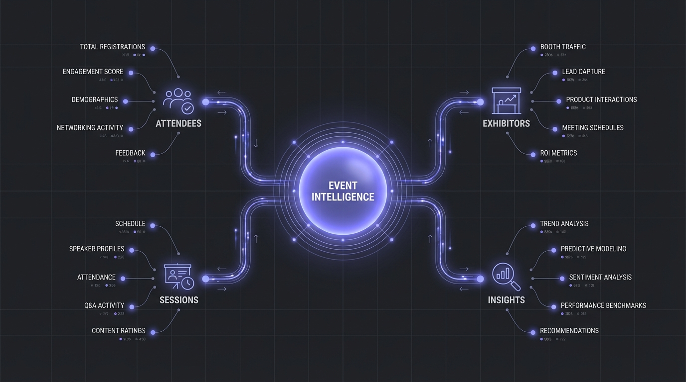
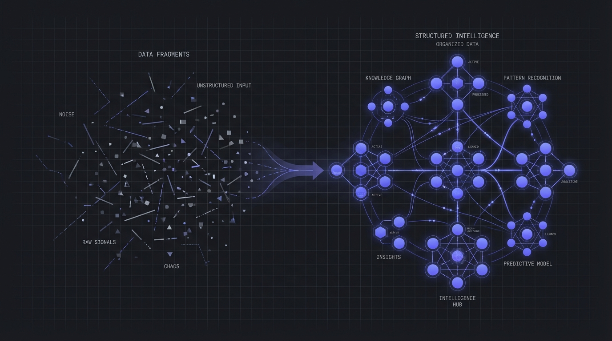
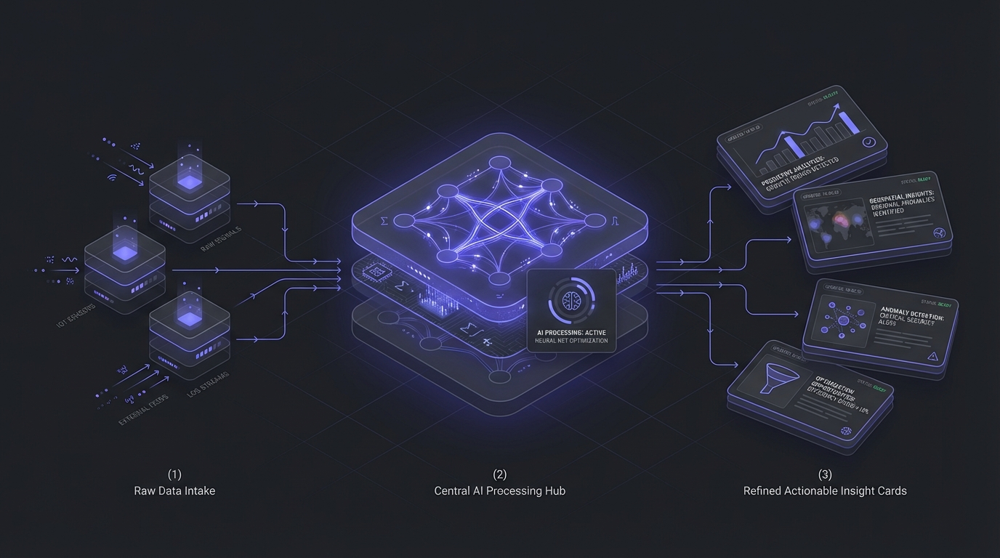
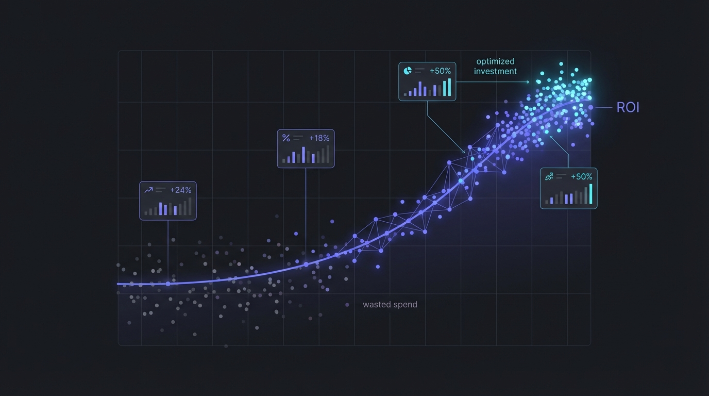

# What Is Event Intelligence? The Data-Driven Approach That's Transforming Trade Shows

**Slug**: /blog/events/what-is-event-intelligence
**Meta Description**: Event Intelligence turns raw event data into actionable insights. Learn what it is, why it matters, and how to use it to maximize your trade show ROI.
**Cover Image**:

---

You just spent $50,000 on a trade show booth. Your team collected 300 business cards, attended a dozen sessions, and shook hundreds of hands.

Now it's Monday morning. Your CRM has a pile of unqualified leads. Your sales team doesn't know who to call first. And your CEO is asking one simple question: **"Was it worth it?"**

You don't have a good answer — and you're not alone. According to CEIR, **76% of exhibitors** struggle to measure event ROI effectively. The problem isn't effort. It's intelligence.

**Event Intelligence** is the practice of collecting, analyzing, and acting on data generated before, during, and after events — transforming scattered signals into strategic decisions. Think of it as the difference between taking notes at a conference and having an AI analyst sitting beside you, prioritizing every conversation, tracking every trend, and telling you exactly what to do next.

In this guide, we'll break down what Event Intelligence actually is, why it's becoming a must-have for B2B teams, and how you can start using it today.

## Why Event Intelligence Matters

The events industry is booming. Global trade show spending is projected to reach **$887.6 billion by 2029**, growing at a 15% CAGR. But bigger budgets don't automatically mean better results.

Here's why the smartest teams are investing in Event Intelligence:

- **70% of event leads go cold within 7 days** without proper follow-up prioritization. Event Intelligence identifies high-intent prospects in real time, so your team knows exactly who to contact first.

- **Data lives in silos.** Badge scans go to one system, meeting notes to another, session attendance to a third. Event Intelligence unifies these signals into a single, actionable view.

- **Competitors are watching — and you're not watching back.** 87% of exhibitors make participation decisions based on gut feeling rather than competitive analysis. Event Intelligence gives you real-time visibility into market movements.

- **Budget optimization is guesswork.** Without data, you can't tell which events drive pipeline and which are expensive networking dinners. Event Intelligence connects event spend to revenue.

**Pro Tip**: Start tracking your "lead-to-meeting" conversion rate per event. This single metric will tell you more about event effectiveness than any post-show survey.

## How Event Intelligence Works: A 5-Step Framework

### Step 1. Capture Signals Before the Event

Event Intelligence begins **weeks before** the event itself. This means:

- Analyzing the **exhibitor list** to identify target accounts and competitors
- Mapping **session topics** to understand industry trends and buyer intent
- Setting up **pre-event outreach** based on attendee data to book meetings in advance

Don't walk into an event blind. The preparation phase is where 80% of the value is created.

**Pro Tip**: Cross-reference the attendee list with your CRM. Flag existing opportunities, churned accounts, and strategic targets before your team even boards the plane.

### Step 2. Collect Data During the Event

This is where most teams stop — and where Event Intelligence goes further. Beyond badge scans and business cards, capture:

- **Session attendance patterns** — which topics drew the biggest crowds?
- **Booth traffic flow** — when are peak hours, and which demos get the most engagement?
- **Conversation context** — quick voice memos or structured notes tagged to contacts
- **Competitor activity** — what are they showcasing, and who's visiting their booth?

### Step 3. Enrich and Unify the Data

Raw data is noise. Intelligence is signal. After the event:

- **Merge** badge scans, meeting notes, and CRM data into unified contact profiles
- **Score** each lead based on engagement signals (booth visit + session attendance + demo request = hot lead)
- **Enrich** with firmographic data — company size, industry, tech stack, funding stage

| Signal | Weight | Example |
|--------|--------|---------|
| Booth visit | Low | Walked by, grabbed a brochure |
| Demo request | High | Sat through full product demo |
| Session + booth visit | Very High | Attended relevant session AND visited booth |
| Meeting booked | Critical | Scheduled 1:1 with your team |

**Pro Tip**: Build a simple lead scoring matrix before the event. Even a basic 1-5 scale based on engagement depth will dramatically improve your follow-up prioritization.

### Step 4. Act Fast with Prioritized Follow-Up

The golden window for event follow-up is **48 hours**. After that, recall drops sharply. Event Intelligence automates this by:

- **Ranking leads** by score so sales calls the hottest prospects first
- **Personalizing outreach** — reference the specific session they attended or demo they watched
- **Routing leads** to the right sales rep based on territory, account ownership, or deal stage

Don't send a generic "Great meeting you at [Event]!" email. That's not follow-up — that's spam with a friendly face.

### Step 5. Measure, Learn, Optimize

This is the step most teams skip entirely — and it's the most valuable.

Build an **Event Intelligence Dashboard** that tracks:

- **Cost per qualified lead** by event
- **Pipeline generated** within 30/60/90 days
- **Win rate** for event-sourced vs. non-event-sourced deals
- **Attendee-to-opportunity conversion rate**

Over time, this data becomes your competitive moat. You'll know exactly which events are worth the investment — and which ones to skip.

## Event Intelligence vs. Traditional Event Management

| Dimension | Traditional Approach | Event Intelligence |
|-----------|--------------------|--------------------|
| **Lead Capture** | Badge scans + business cards | Multi-signal scoring (visits, demos, sessions, meetings) |
| **Follow-Up** | Batch email blast post-event | Prioritized, personalized outreach within 48 hours |
| **Competitor Tracking** | Anecdotal ("I saw their booth") | Systematic monitoring of exhibitor activity and messaging |
| **ROI Measurement** | "We got 300 leads" | Pipeline attribution: $X revenue from $Y event spend |
| **Decision Making** | "We've always done this event" | Data-driven event portfolio optimization |

## Getting Started: Your Event Intelligence Checklist

You don't need a six-figure platform to start. Here's a practical roadmap:

- [ ] **Define 3-5 key metrics** you'll track at your next event (lead score, meetings booked, pipeline generated)
- [ ] **Build a lead scoring template** before the event (even a spreadsheet works)
- [ ] **Assign a data owner** — one person responsible for collecting and unifying event signals
- [ ] **Set a 48-hour follow-up SLA** with your sales team
- [ ] **Run a 30-day post-event review** — what worked, what didn't, what changes for next time?

## The Bottom Line

Event Intelligence isn't a product you buy — it's a practice you build. It starts with asking better questions, capturing better data, and acting on insights faster than your competition.

The companies winning at trade shows in 2025 aren't the ones with the biggest booths. They're the ones who **know more, act faster, and measure everything**.

Start small. Pick your next event. Track the signals. Score the leads. Measure the results. That's Event Intelligence — and it's how you turn a $50,000 booth into a $500,000 pipeline.

**Ready to transform your event strategy?** Start with the checklist above and build from there. The data is already there — you just need to start listening.
